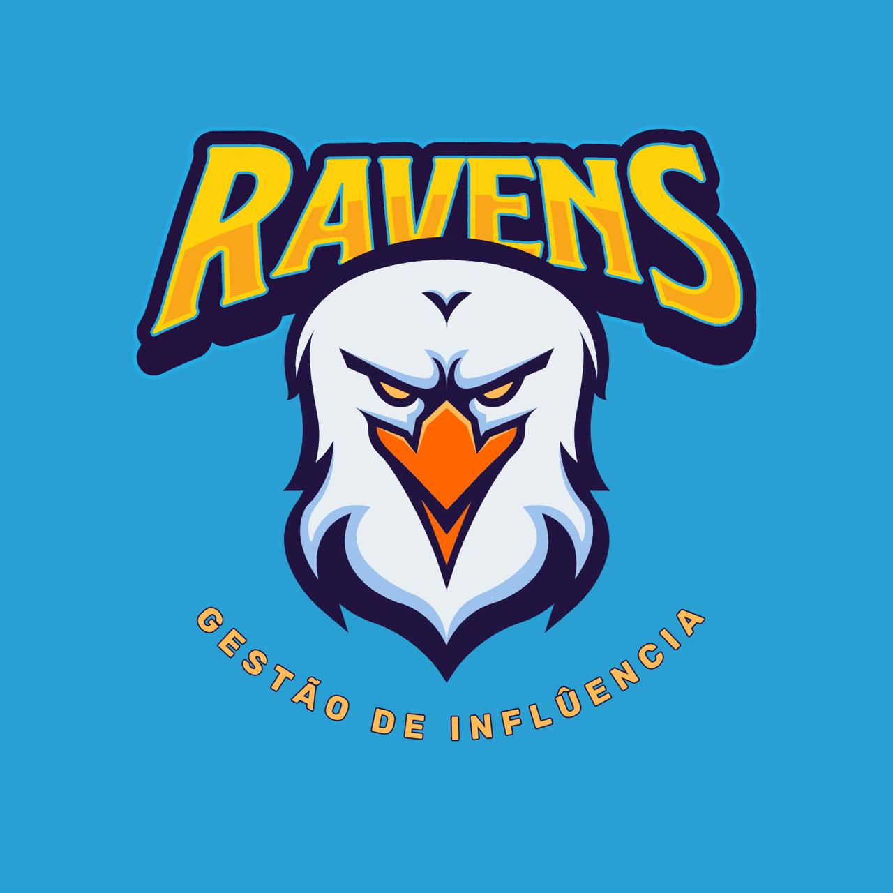

<!DOCTYPE html>
<html lang="pt-br">
<head>
    <meta charset="UTF-8">
    <meta name="viewport" content="width=device-width, initial-scale=1.0">
    <title>HOME</title>

    <link rel="website icon"type="png" href="logo.png">

</head>

<body>
  <br 

  <button onclick="scrollToBottom()">Sobre a Empresa</button>

  
  <header>
    <h1>Ravens</h1>
    <h2>Gerenciamento de Atletas e influencers</h2>
</header>

 

  
       
    
 
      

        <a href="http://localhost/Login.php">Login</a>
        <a href="http://localhost/formulario.php">Cadastro</a>
      

                                

      

          <h3>Sobre a Empresa</h3>
          
A Empresa de Gestão de Atletas é líder no mercado, proporcionando suporte abrangente e personalizado para atletas profissionais em todo o mundo. Com uma equipe dedicada de especialistas em gestão esportiva, nos orgulhamos de oferecer serviços de alta qualidade para maximizar o potencial de nossos clientes.

      

      

          <h3>Informações de Contato</h3>
          
Entre em contato conosco para saber mais sobre nossos serviços ou agendar uma consulta.

          <ul>
              <li>Email: Ravens@gestaodeatletas.com</li>
              <li>Telefone: +11 1249-5789</li>
              <li>Endereço: R. Visc. de Pirajá, 550-580 - Ipanema, Rio de Janeiro - RJ, 22410-002 , Brasil</li>
          </ul>
      

      

          <h3>Siga-nos</h3>
          <ul>
              <li><a href="https://www.facebook.com/gestaodeatletas">Facebook</a></li>
                 
              <li><a href="https://twitter.com/gestaodeatletas">Twitter / X</a></li>
                
              <li><a href="https://www.instagram.com/gestaodeatletas">Instagram</a></li>
              
          </ul>
      

      
&copy; 2023 Gestão de Atletas

  </footer>
  
  </footer>

</body>
</html>
